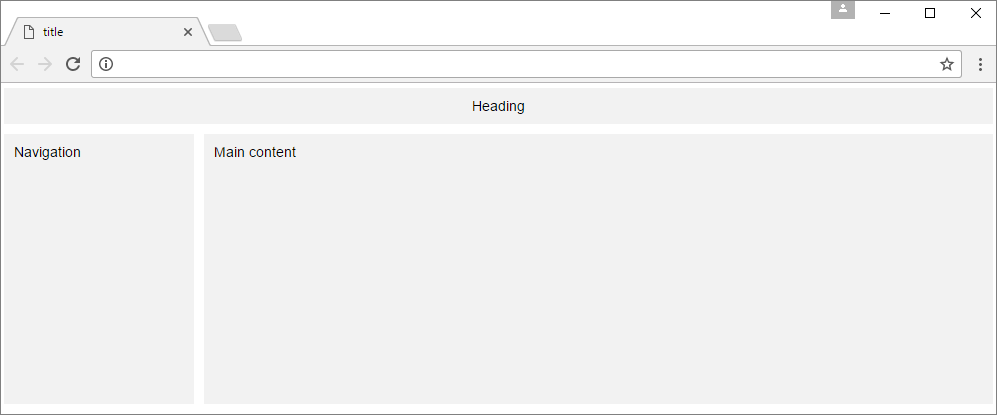
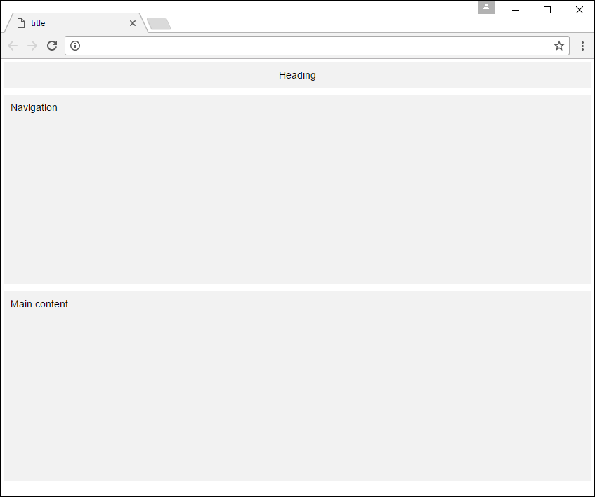
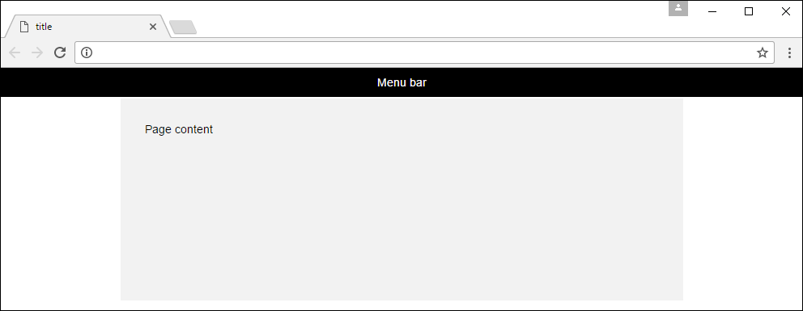
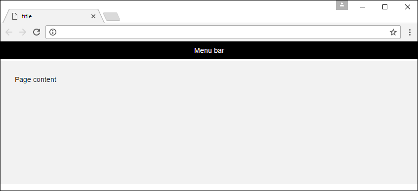

##

 

## **Webui**

*Web design made easy*

[](https://github.com/asyncdesign/webui/blob/master/LICENSE)


The purpose of webui is to offer an alternative to larger frameworks, providing a small, flexible, efficient and easy to use system to create websites quickly. The philosophy is to follow a <span class="color-accent-2">"Simplicity is the ultimate sophistication"</span> approach, providing simple building blocks to contruct much larger CSS components without the pain. Complex data entry forms can be created in a precise layout using the built-in grid system that doesn't throw any surprises. Add responsive behaviour exactly where you want it, with the flexibility to create fixed non-responsive layouts or layout sections.

Webui allows you to create your web app without getting distracted by complexity.

**Check out the [full documentation](https://asyncdesign.github.io/webui/) to learn more about webui**

### **Getting Started**

* [Download the latest release](https://github.com/asyncdesign/webui/archive/v4.3.2.zip)
* Extract the CSS and JavaScript files from the dist folder to your project folders.
* You will need to include a version of jQuery. Webui has been tested with jQuery 1.7.2 and later.
* In your web page add a link to the CSS in the head section of your page and links to the JavaScript files at the bottom of the body section, for example:

````html
<html>
<head>
  <link rel="stylesheet" href="css/webui.min.css"> 
</head>
<body>

  <script src="js/jquery-2.2.0.min.js"></script>
  <script src="js/webui.min.js"></script>
</body>
</html>
````

That's it. You are ready to start developing with Webui.

If you want to download and build the project please see detailed instructions on cloning the Git repository and performing builds see the [Cloning the repository](DOCUMENTATION.md#cloneRepository) and [Performing builds](DOCUMENTATION.md#performBuilds) sections.

### **Creating page layouts**

Webui uses a 20 column grid system to create layouts. In general, each row will contain from 1 to 20 columns, and each column can contain any other content. Most likely you will be using a shared layout to display common parts of your website. Here is a quick example of a shared layout structure with a container and some rows and columns:

````html
<div class="container">
  <div class="form-row">
    <div class="form-col-20 align-center respond-md">
      <div class="panel secondary">
        Heading
      </div>
    </div>  
  </div>
  <div class="form-row">
    <div class="form-col-4 respond-md">
      <div class="panel secondary height-10">
        Navigation
      </div>
    </div>
    <div class="form-col-16 respond-md">
      <div class="panel secondary height-10">
        Main content
      </div>
    </div>
  </div>
</div>
````
The respond-md class on the columns will cause the form to re-render for a mobile screen size at the medium breakpoint. You won't normally need the height-10 class as it's just added here to give some height in the browser for the screenshot, but it is a class that is available in Webui. Then, within each column there is a panel container using the secondary foreground and background theme colors. 

Here is the result of the above code in the browser.



When the screen width is reduced to the medium breakpoint size it would appear as follows. 



You may prefer a bootstrap style centered layout, and you can easily do that with the the code below.

````html
<div class="container">
  <div class="content-row menu-bar-sm default align-center">
    <div class="content-row">   
      <div class="form-col-20 form-col-align-sm">
        Menu bar
      </div>
    </div>
  </div>
  <div class="content-row"> 
    <div class="content-col-3 respond-md">      
    </div>
    <div class="content-col-14 height-10 secondary respond-md">
      <div class="area">
        Page content
      </div>
    </div>
    <div class="content-col-3 respond-md">      
    </div>
  </div>
</div>
````
This is how it would look in the browser. Again, the height-10 class is used here for demonstration purposes. If you wanted the menu bar to match the width of the content area, you can just take the 7 lines for the menu bar row and drop them just inside the second column of the second row.



Then, at a medium screen size it would look like this



**Check out the [full documentation](https://asyncdesign.github.io/webui/) to learn more about webui**

