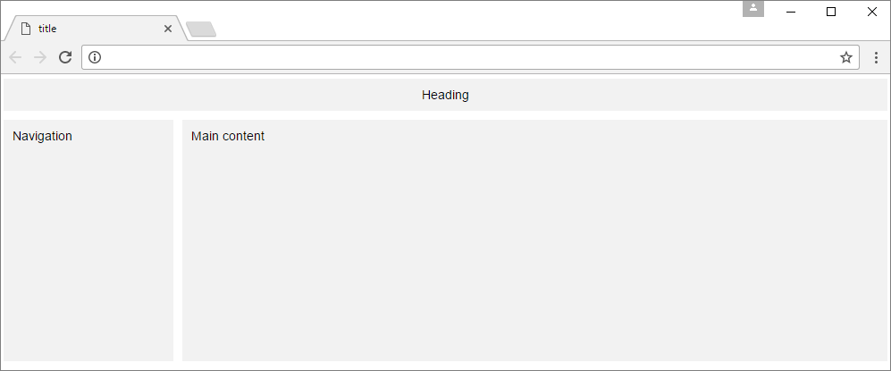
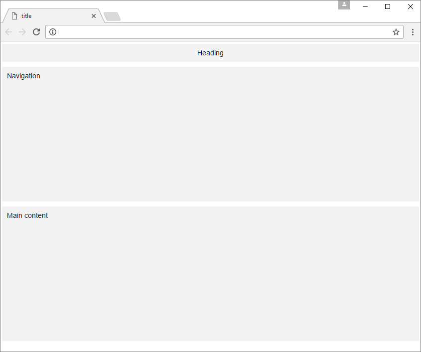
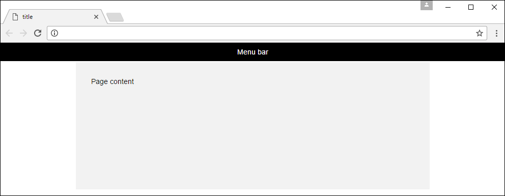

##

 

## **Webui**

*Web design made easy*

[](https://github.com/asyncdesign/webui/blob/master/LICENSE)


WebUI is a little different to most other CSS frameworks due to an emphasis on flexibility and creativity. Although most frameworks do attempt to provide flexibility, they often enforce a particular
approach or style, and come with too many limitations. WebUI has been build from the ground up with flexibility as the primary goal - even the components are made that way. WebUI is a system that allows 
you to invent new designs, and provides simple building blocks to construct much larger CSS components. Complex data entry forms can be created in a precise layout using the built-in grid system that 
doesn't throw any surprises. Add responsive behaviour exactly where you want it, with the flexibility to create fixed non-responsive layouts or layout sections.

**Check out the [full documentation](https://asyncdesign.github.io/webui/) to learn more about webui**

### **Getting Started**

**Install the latest release using NPM**

`npm install asyncdesign-webui`

or

**Install the latest release using NuGet**

`Install-Package asyncdesign-webui`

or

**Install the latest release using Bower**

`bower install asyncdesign-webui`

or

[Download the latest release](https://github.com/asyncdesign/webui/archive/v6.4.3.zip)
* Extract the CSS and JavaScript files from the dist folder to your project folders.
* WebUI has no dependencies, so you don't need to include jQuery.
* In your web page add a link to the CSS in the head section of your page and links to the JavaScript files at the bottom of the body section, for example:

````html
<html>
<head>
  <link rel="stylesheet" href="css/webui.min.css"> 
</head>
<body>

  <script src="js/webui.min.js"></script>
</body>
</html>
````

That's it. You are ready to start developing with WebUI.

Be sure to look at the static **DEMO** pages at the root of the download, containing many examples that demonstrate a good selection of components.

### **Creating page layouts with flexbox**

WebUI includes a flexbox module as well as a traditional grid system by default, as it is recommended to make use of both to provide maximum flexibility and browser support. 
However, if you don't need both, you can easily exclude one by removing the include in the webui.scss file located in the **src/scss** folder of the project, then just 
build the project using the supplied grunt tasks. 

````html
<div class="container responsive-gutter-md">
  <div class="flex-row">
    <div class="flex-col pad-xs">
      <div class="panel secondary text-center">
        Heading
      </div>
    </div>  
  </div>
  <div class="flex-row">
    <div class="flex-size-15 flex-respond-bp-2-under">
      <div class="flex-col pad-xs">
        <div class="panel secondary height-full">
           Main
           <p>Pellentesque habitant morbi tristique senectus et netus et 
              malesuada fames ac turpis egestas. Vestibulum tortor quam, feugiat
              vitae, ultricies eget, tempor sit amet, ante.</p>
        </div>
      </div>
    </div>
    <div class="flex-size-5 flex-respond-bp-2-under flex-order-first-bp-2-under">
      <div class="flex-col pad-xs">
        <div class="panel secondary height-full">
           Navigation
           <p>Pellentesque habitant morbi tristique senectus et netus et 
              malesuada fames ac turpis egestas. Vestibulum tortor quam, feugiat
              vitae, ultricies eget, tempor sit amet, ante.</p>
        </div>
      </div>
    </div>
  </div>
</div>
````

It's very easy to create flexbox layouts with WebUI. Just use a flex-rows, flex-columns and flex items (flex-size-*, flex-auto, flex-initial, etc.) 
You can also take advantage of the many flexbox responsive utility classes available. 

Here's another flexbox example - this time creating a simple responsive navbar.

````html
<div class="container pad-xs background-dark">
  <div class="flex-row flex-items-center flex-justify-space-between flex-direction-column-bp-1-under">
    <div class="flex-initial flex-justify-center-bp-1-under">
      <a href="javascript:void 0" class="color-accent-2 text-xl">COMPANY LOGO</a>
    </div>				
    <div class="flex-auto flex-wrap flex-justify-center flex-justify-space-around flex-direction-column-bp-1-under">
      <a href="#0" class="text-sm color-light color-hover-success col-spacing-sm">PAGES</a>
      <a href="#0" class="text-sm color-light color-hover-success col-spacing-sm">PROMOTIONS</a>
      <a href="#0" class="text-sm color-light color-hover-success col-spacing-sm">PRODUCTS</a>
    </div>			
    <div class="flex-initial flex-justify-end-bp-1-over">
      <input type="text" class="input-md width-full" placeholder="" />
    </div>
  </div>
</div>
````

### **Creating page layouts with the traditional grid system**

WebUI uses a 20 column grid system to create grid layouts. In general, each row will contain from 1 to 20 columns, and each column can contain any other content. 
Most likely you will be using a shared layout to display common parts of your website. Here is a quick example of a shared layout structure with a container and some rows and columns:

````html
<div class="container">
  <div class="form-row">
    <div class="form-col-20 text-center respond-bp-3-under">
      <div class="panel secondary">
        Heading
      </div>
    </div>  
  </div>
  <div class="form-row">
    <div class="form-col-4 respond-bp-3-under">
      <div class="panel secondary height-xl">
        Navigation
      </div>
    </div>
    <div class="form-col-16 respond-bp-3-under">
      <div class="panel secondary height-xl">
        Main content
      </div>
    </div>
  </div>
</div>
````
The respond-bp-3-under class on the columns will cause the form to re-render for a mobile screen size at the medium breakpoint. 
You won't normally need the height-xl class as it's just added here to give some height in the browser for the screenshot, but it is 
a class that is available in WebUI. Then, within each column there is a panel container using the secondary foreground and background theme colors. 

Here is the result of the above code in the browser.



When the screen width is reduced to the medium breakpoint size it would appear as follows. 



You may prefer a bootstrap style center layout, and you can easily do that with the code below by using the responsive-gutter-* classes.

````html
<div class="container responsive-gutter-lg">
  <div class="content-row menu-bar-sm dark">
    <div class="form-col-20 form-col-align-lg text-center">
      Menu bar
    </div>
  </div>
  <div class="content-row">	
    <div class="content-col-20 height-xl secondary respond-bp-3-under">
      <div class="area">
        Page content
      </div>
    </div>
  </div>
</div>
````
The width of the gutters will automatically adjust, reducing towards the smallest breakpoint and increasing towards the largest. At the smallest 
breakpoint there will be no gutter. Responsive gutters can be used with any container type or on any row type, but should not be used directly on 
columns, so there is no problem with placing containers inside columns and applying responsive gutters to the containers.

This is how it would look in the browser.



**Check out the [full documentation](https://asyncdesign.github.io/webui/) to learn more about webui**
